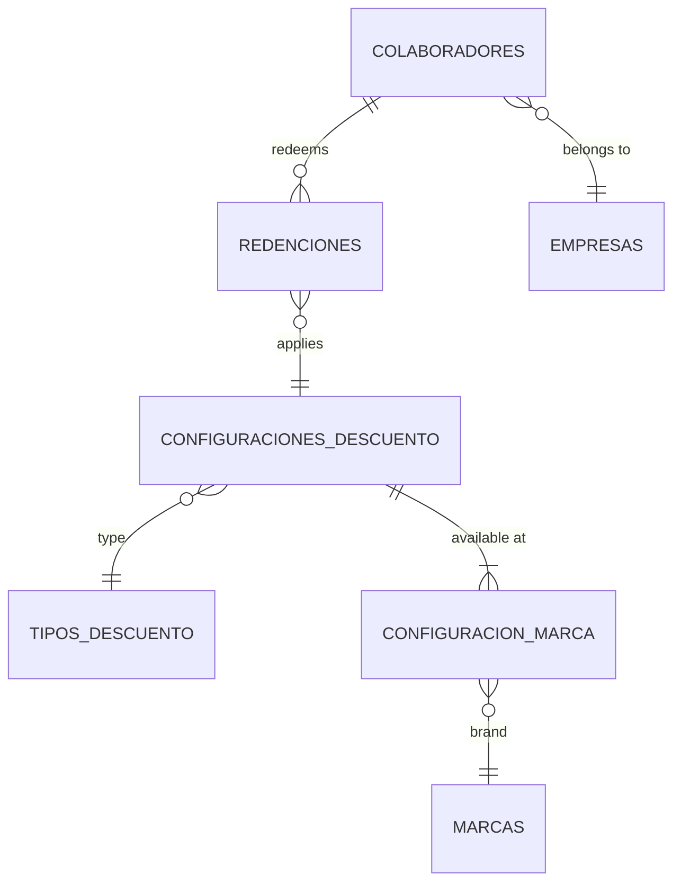

# Data Modeling

You are guiding the user through data modeling — translating the domain model into
a persistence design for their chosen database technology. The domain model defines
what exists in the business. The data model defines how you store it.

This distinction matters: code is malleable, data is cement. You can refactor
controllers, rewrite services, or swap frontends. Changing a data model in production
with real users and gigabytes of information is orders of magnitude more expensive.
The goal of this skill is to get the data model right before writing the first
migration.

## When to use this skill

Use this skill when the user:
- Has a completed domain model (bounded contexts, entities, invariants, lifecycles)
- Has decided on a database technology (via an ADR or explicit decision)
- Is ready to design the persistence layer before writing code

Do NOT use this skill when:
- The domain model does not exist yet — run the `domain-modeling` skill first
- The database technology has not been decided — run the `architecture-decisions`
  skill first to produce an ADR
- The user is building a throwaway prototype — persistence design is wasted effort
  on something that will be discarded

## Prerequisites — check these first

Before starting, verify the user has:

1. **Domain model output** — specifically:
   - `entities-aggregates.md` with entities using semantic types, value objects,
     aggregate roots, and business rules
   - `invariants.md` with numbered invariants and validation matrix
   - `domain-events.md` with event catalog
   - `lifecycle.md` with state machines

2. **Database technology decision** — which database engine and why. This typically
   comes from an ADR (e.g., "ADR-001: PostgreSQL because we need ACID transactions,
   relational joins, and the team has expertise"). The chosen technology determines
   everything in this skill: types, constraints, indexing strategies, and
   concurrency patterns.

If the domain model is missing or incomplete, stop and say so. Point the user to
the `domain-modeling` skill. If the database decision has not been made, point them
to the `architecture-decisions` skill.

If the user has both but they are informal (e.g., "I have some entities defined
and we're using Postgres"), work with what they have. Ask for the entity list and
their attributes to get started.

## How you work

**Step by step, not all at once.** Each step builds on the previous and needs
validation before proceeding. Data modeling mistakes are expensive — catching them
in review is 100x cheaper than catching them in production.

**Your principles:**
- Start from value, not from tables. Ask "what does the user need to retrieve?"
  before asking "what columns do I need?"
- Normalize by default. Denormalize only with explicit justification.
- The database is your bouncer. Prefer constraints enforced in the database over
  constraints enforced only in application code. Application code can be bypassed
  (direct queries, scripts, migrations, new services). Database constraints cannot.
- Every column must be explainable. If you cannot write one sentence explaining what
  a column means, it should not exist.
- Flag migration complexity. If the user is migrating from a legacy system, identify
  mappings and transformation needs explicitly.

## Step 0: Understand the technology constraints

**Goal:** Establish what the chosen database can and cannot do, so you design within
its strengths.

Ask the user (or confirm from the ADR):
- Which database engine and version? (PostgreSQL 15, DynamoDB, MySQL 8, etc.)
- Relational or NoSQL? (This fundamentally changes the approach.)
- Are there existing tables or is this greenfield?
- Are there other systems that will read/write this data directly? (Shared database
  patterns require extra care.)
- What are the expected data volumes? (Affects indexing and partitioning decisions.)

**For relational databases (PostgreSQL, MySQL, etc.):**
The rest of this skill applies directly. Proceed step by step.

**For DynamoDB or other NoSQL:**
The approach changes significantly. Instead of ER diagrams and normalization, you
design access patterns first:
- List every query the application needs to make
- Design partition keys and sort keys to serve those queries
- Use single-table design or multi-table based on access pattern complexity
- GSIs (Global Secondary Indexes) for secondary access patterns

Tell the user this and adjust your approach accordingly. The output format changes
but the principles remain: document everything, justify decisions, map invariants
to enforcement mechanisms.

**Wait for user validation before proceeding.**

## Step 1: Map entities to tables

**Goal:** Translate each domain entity into a database table with concrete types.

For each entity in the domain model, produce a table definition:

```markdown
### table_name

| Column | DB type | Nullable | Default | Description |
|--------|---------|----------|---------|-------------|
| (name) | (type)  | YES/NO   | (if any)| (one sentence) |
```

**Translation from semantic types to database types:**

This table is for PostgreSQL. Adjust for the user's chosen database.

| Semantic type | PostgreSQL type | Notes |
|---------------|----------------|-------|
| identifier | UUID | Use gen_random_uuid() for generation |
| natural-key | VARCHAR(N) | Size based on known values |
| text | VARCHAR(N) or TEXT | VARCHAR when max length is known |
| quantity | INTEGER | CHECK >= 0 when non-negative |
| money | NUMERIC(precision, scale) | Never use FLOAT for money |
| percentage | NUMERIC(5,2) | CHECK between 0 and 100 |
| date | DATE | No time component |
| moment | TIMESTAMPTZ | Always with timezone |
| time-of-day | TIME | Without timezone |
| duration | INTEGER | Store as base unit (days, minutes) |
| flag | BOOLEAN | Default value is almost always needed |
| state | VARCHAR(N) | CHECK constraint with valid values |
| category | VARCHAR(N) | CHECK constraint with valid values |
| reference | UUID or VARCHAR(N) | FK to referenced table, match target PK type |
| flexible-structure | JSONB | For truly semi-structured data only |

**Rules to follow:**
- Name tables in lowercase snake_case, plural (colaboradores, redenciones, tiendas).
- Name columns in lowercase snake_case, singular.
- Every table gets a primary key. Prefer UUID for internal entities, natural-key
  for catalog entities with standardized codes.
- Add `created_at TIMESTAMPTZ NOT NULL DEFAULT now()` and
  `updated_at TIMESTAMPTZ NOT NULL DEFAULT now()` only when the domain model or
  audit requirements justify tracking creation/modification times. Do not add them
  mechanically to every table.
- Translate value objects into either: columns on the parent table (for simple
  value objects like document = number + type), or a separate table (for value
  objects that repeat across entities or have their own query needs).

**Present tables one bounded context at a time. Wait for user validation before
proceeding.**

## Step 2: Define relationships and foreign keys

**Goal:** Translate domain relationships into concrete FK constraints.

For each relationship in the domain model:

| Relationship | FK column | References | On Delete | On Update | Rationale |
|-------------|-----------|------------|-----------|-----------|-----------|
| (description) | (column) | (table.pk) | (action) | (action) | (why this action) |

**On Delete behavior — choose deliberately:**
- `RESTRICT` — prevent deletion if children exist. Default safe choice.
- `CASCADE` — delete children when parent is deleted. Use only when children have
  no independent meaning without the parent.
- `SET NULL` — set FK to null. Use when the relationship is optional and the child
  survives independently.
- Never leave this to the database default. Every FK action must be a conscious decision.

**Cardinality enforcement:**
- 1:1 — FK with UNIQUE constraint on the FK column
- 1:N — FK on the "many" side, no UNIQUE
- N:M — junction table with composite PK (fk_a, fk_b)

**Present the relationship table. Wait for user validation before proceeding.**

## Step 3: Map invariants to enforcement layers

**Goal:** Decide where each business rule is enforced — database, application, or both.

Take the invariants from the domain model and produce:

| Invariant | Enforcement | Mechanism | Rationale |
|-----------|-------------|-----------|-----------|
| INV-01 | Database | CHECK constraint | Cannot be bypassed by any code path |
| INV-02 | Both | UNIQUE constraint + app validation | DB guarantees uniqueness, app gives friendly error |
| INV-03 | Application | Domain service | Requires cross-entity logic the DB cannot express |
| INV-04 | Database | FK + RESTRICT | Referential integrity is a DB concern |

**Decision framework for enforcement layer:**

- **Database** when: the rule can be expressed as a constraint (CHECK, UNIQUE, FK,
  NOT NULL, exclusion constraint) and must be enforced regardless of which service
  or script writes to the database. Prefer this whenever possible.
- **Application** when: the rule requires cross-entity or cross-table logic that
  the database cannot express in a single constraint, or when the rule depends on
  runtime context (current user, external API response, business clock).
- **Both** when: the database provides the safety net (e.g., UNIQUE) but the
  application provides the user-friendly error message or pre-validation.

**Produce the mapping. Wait for user validation before proceeding.**

## Step 4: Design indexes

**Goal:** Ensure queries are fast for actual access patterns, without over-indexing.

Indexes are NOT free. Each index slows down writes and consumes storage. Only create
indexes that serve real access patterns.

Start from the use cases, not from the schema:

1. List the main queries the application will execute (derived from use cases).
2. For each query, identify which columns appear in WHERE, JOIN, and ORDER BY.
3. Design indexes to serve those queries.

**Document each index with justification:**

| Table | Index | Columns | Type | Serves query |
|-------|-------|---------|------|-------------|
| redenciones | idx_redenciones_colaborador_fecha | (colaborador_id, fecha) | B-tree | "Get today's redemptions for a collaborator" |
| configuraciones_descuento | idx_config_estado_vigencia | (estado, vigencia_desde, vigencia_hasta) | B-tree | "Find active configs valid today" |

**Rules:**
- Primary keys and UNIQUE constraints create indexes automatically. Do not duplicate.
- Foreign keys in PostgreSQL do NOT create indexes automatically. Add them explicitly
  when the FK column appears in WHERE or JOIN clauses.
- Composite indexes: put the most selective column first, or the equality column
  before the range column.
- Do not add indexes "just in case." Every index must answer: "Which use case query
  does this serve?"
- For tables expected to grow large, note partitioning candidates.

**Present the index plan. Wait for user validation before proceeding.**

## Step 5: Produce the ER diagram

**Goal:** Visualize the entire data model in one diagram.

Produce an ER diagram using text-based notation that can be rendered with standard
tools (Mermaid, dbdiagram.io, or ASCII art).

**Preferred format — Mermaid:**



**Guidelines:**
- Include all tables and their relationships
- Show cardinality (one-to-many, many-to-many)
- Keep the diagram clean — if it looks tangled, the data model may have problems
- Group tables by bounded context visually if possible

**Present the diagram. Wait for user validation before proceeding.**

## Step 6: Write the data dictionary

**Goal:** Make every column self-explanatory for anyone who reads the schema 6 months
from now.

For each table, produce a data dictionary entry:

```markdown
### colaboradores

**Purpose:** Stores employee records for both NGR and Intercorp groups. Source of
truth for collaborator identity and status in the discount system.

| Column | Type | Nullable | Description |
|--------|------|----------|-------------|
| colaborador_id | UUID | NO | Internal unique identifier. Generated by the system. |
| documento_numero | VARCHAR(20) | NO | Government ID number. Part of the natural unique key (with documento_tipo). |
| documento_tipo | VARCHAR(10) | NO | Type of government ID: DNI, CE, or PAS. |
| empresa_id | UUID | NO | Company this collaborator belongs to. References empresas. |
| estado | VARCHAR(10) | NO | Current status: ACTIVO or INACTIVO. Only modified by ingestion processes, never by admin. |
| tienda_code | VARCHAR(10) | YES | Store where this collaborator works. NULL for Intercorp employees and NGR employees without store (IT, admin, supervisors). |

**Constraints:**
- PK: colaborador_id
- UNIQUE: (documento_numero, documento_tipo)
- FK: empresa_id → empresas(empresa_id) ON DELETE RESTRICT
- FK: tienda_code → tiendas(tienda_code) ON DELETE RESTRICT
- CHECK: estado IN ('ACTIVO', 'INACTIVO')
- CHECK: documento_tipo IN ('DNI', 'CE', 'PAS')

**Invariants enforced here:**
- INV-01 (active status): CHECK on estado column. Application also validates before operations.
- INV-XX (unique document): UNIQUE constraint on (documento_numero, documento_tipo).

**Notes:**
- tienda_code is nullable because three groups of collaborators don't have a store:
  NGR employees in administrative roles, NGR employees in IT/supervision, and all
  Intercorp employees.
```

**Rules for the data dictionary:**
- Every table gets a **Purpose** sentence explaining what it stores and why.
- Every column gets a **Description** that a new developer can understand without
  asking someone.
- Every nullable column gets an explanation of why it is nullable.
- List all constraints (PK, FK, UNIQUE, CHECK) explicitly.
- Reference which invariants from the domain model are enforced at this level.
- Add **Notes** for anything non-obvious: why a denormalization exists, why a column
  uses a specific type, migration considerations.

**Produce the dictionary table by table. Wait for user validation before proceeding.**

## Step 7: Document migration and legacy mappings (if applicable)

**Goal:** If migrating from a legacy system, make the mapping explicit.

If the user has an existing database or data source, produce a migration mapping:

| New column | Source system | Source field | Transformation | Notes |
|-----------|-------------|-------------|----------------|-------|
| tienda_code | DynamoDB tiendas | code | Direct copy | Used as natural key |
| marca_code | DynamoDB tiendas | company | Direct copy | "BB" = Bembos |
| ciudad_id | DynamoDB tiendas | (none) | Geocode from lat/long or manual mapping | Field does not exist in source. See open problem. |

**For each mapping, document:**
- Direct copies (no transformation needed)
- Transformations (type conversion, enum mapping, concatenation)
- Missing fields (data that does not exist in the source and must be created)
- Data quality issues (nulls where not expected, inconsistent formats)

If there is no legacy system, skip this step.

**Present the mapping. Wait for user validation before proceeding.**

## When to stop

The data model is complete when:

1. Every domain entity has a corresponding table (or explicit decision not to persist it).
2. Every invariant has an enforcement layer assigned with mechanism documented.
3. Every access pattern from use cases has an index or query plan.
4. The ER diagram is clean — no orphan tables, no tangled relationships.
5. The data dictionary covers every column in every table.

## Producing the final documents

Once all steps are validated, produce the output files.

**Output directory:** `analysis/data-model/`

### Files to produce:

**`schema.md`**
- Database engine and version
- Naming conventions
- All table definitions with column types, nullability, defaults
- All constraints (PK, FK, UNIQUE, CHECK)
- Relationship table with ON DELETE/ON UPDATE actions

**`invariant-enforcement.md`**
- Invariant-to-enforcement mapping table
- Rationale for each enforcement decision
- Constraints that could not be expressed in the database (and why)

**`indexes.md`**
- Index plan with justification per index
- Access patterns served by each index
- Partitioning candidates (if applicable)

**`er-diagram.md`**
- Mermaid (or equivalent) ER diagram
- Bounded context grouping if applicable

**`data-dictionary.md`**
- Per-table: purpose, column descriptions, constraints, invariants enforced, notes
- Nullable rationale for every nullable column

**`migration-mapping.md`** (only if migrating from legacy)
- Source-to-target field mapping
- Transformations required
- Data quality issues and open problems

## Checklist

Before producing final documents, verify:

- [ ] Database engine and version are stated explicitly
- [ ] Every domain entity has a table definition
- [ ] All columns use database-appropriate types (no semantic types remain)
- [ ] Value objects are translated to columns or tables with clear rationale
- [ ] Every FK has explicit ON DELETE and ON UPDATE actions with rationale
- [ ] Every invariant has an enforcement layer (database, application, or both)
- [ ] Database-enforceable invariants have concrete constraint definitions
- [ ] Indexes are justified by actual access patterns from use cases
- [ ] No speculative indexes exist ("just in case")
- [ ] ER diagram is clean and complete
- [ ] Data dictionary covers every column with human-readable descriptions
- [ ] Every nullable column has documented rationale
- [ ] Migration mappings are documented (if applicable)
- [ ] No semantic types from domain model leaked into the data model
- [ ] The data model can be reviewed by someone who has not read the domain model
